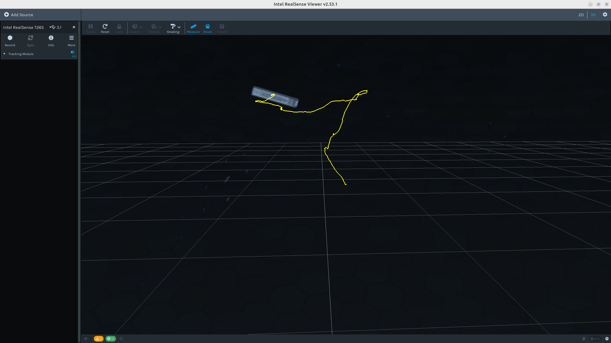
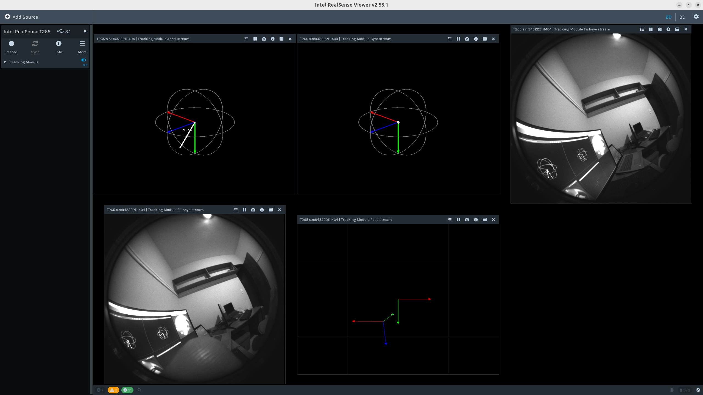

# Realsense-T265

Since the Realsense T265 has been officially removed from support, in order to avoid multiple version conflicts, this repository backtracks to the official libraries and ROS2 packages that can support the T265 model, and builds them from source code for local installation and operation.

## Installation Instructions
The repository is compiled and tested in the following system environment, and other environments are modified according to the actual situation.

### Step 1: Install the ROS2 distribution
- **Ubuntu 24.04:**
  - [ROS2 Jazzy](https://docs.ros.org/en/jazzy/Installation/Ubuntu-Install-Debs.html)

### Step 2: Download source
  ```bash
  cd [ros2_ws]/src
  git clone https://github.com/fjscoelho/RealsenseT265.git
  ```

### Step 3: Build and install the Intel&reg; RealSense&trade; SDK 2.0
  ```bash
  cd [path_librealsense] && mkdir build && cd build
  cmake -DCMAKE_INSTALL_PREFIX=../install ..
  make & make install
  ```
### Step 4 (Optional): Run realsense-viewer
  ```bash
  export LD_LIBRARY_PATH=[path_librealsense]/install/lib:$LD_LIBRARY_PATH
  ./realsense-viewer
  ```
If a popup appears with the message "Missing/outdated UDEV-Rules will cause 'Permissions Denied' errors", then run the following commands:
  ```bash
  find [path_librealsense] -name "*udev*" -o -name "*rules*"
  ls -la ~/.99-realsense-libusb.rules
  sudo cp ~/.99-realsense-libusb.rules /etc/udev/rules.d/99-realsense-libusb.rules && sudo udevadm control --reload-rules && sudo udevadm trigger
  ```
After entering your password, the command will:

  - Copy the `~/.99-realsense-libusb.rules` file to `/etc/udev/rules.d/99-realsense-libusb.rules`.
  - Reload the UDEV rules using udevadm control `--reload-rules`.
  - Apply the new rules with `udevadm trigger`.

Post-Installation Steps:

  1. Close the `realsense-viewer` application if it is currently open.
  2. Disconnect and reconnect your RealSense camera (or simply restart your computer if you prefer).
  3. Reopen realsense-viewer — the UDEV warning popup should no longer appear, and you should be able to access the camera without any permission errors.

  <div align="center">
  
  <br/>
  <em>Figure 1: RealSense Viewer 3D mode with TrackingModule ON</em>
  </div>

  <div align="center">
  
  <br/>
  <em>Figure 1: RealSense Viewer 2D mode</em>
  </div>

#### Create a shortcut for realsense-viewer (optional)
To make it easier to use, create a global shortcut that automatically sets `LD_LIBRARY_PATH` and runs `realsense-viewer`. Run the commands below once:

```bash
echo 'export LD_LIBRARY_PATH=[path_librealsense]/install/lib:$LD_LIBRARY_PATH && [path_librealsense]/install/bin/realsense-viewer' > /tmp/realsense-viewer.sh && chmod +x /tmp/realsense-viewer.sh
sudo mv /tmp/realsense-viewer.sh /usr/local/bin/realsense-viewer && sudo chmod +x /usr/local/bin/realsense-viewer
```

### Step 5: Install dependencies
  ```bash
  cd [ros2_ws]
  sudo apt-get install python3-rosdep -y
  sudo rosdep init # "sudo rosdep init --include-eol-distros" for Dashing
  rosdep update
  rosdep install -i --from-path src --rosdistro $ROS_DISTRO --skip-keys=librealsense2 -y
  ```
### Step 5: Build
  ```bash
  colcon build --symlink-install --packages-ignore librealsense2 --cmake-args -DCMAKE_EXPORT_COMPILE_COMMANDS=ON -G Ninja
  ```

> **Tip:** If you see an error like **"CMake was unable to find a build program corresponding to \"Ninja\""**, install Ninja with:
> ```bash
> sudo apt-get install ninja-build
> ```
> Then rerun the build command above.

### Step 6: Terminal environment
  ```bash
  ROS_DISTRO=<YOUR_SYSTEM_ROS_DISTRO>  # set your ROS_DISTRO: humble, galactic, foxy, eloquent, dashing
  source /opt/ros/$ROS_DISTRO/setup.bash
  cd [ros2_ws]
  source install/local_setup.bash
  ```

## Usage Instructions

### Start the camera node
To start the camera node:

```bash
ros2 run realsense2_camera realsense2_camera_node --ros-args -p enable_pose:=true -p device_type:=t265
```
or, with a launch file:
```bash
ros2 launch realsense2_camera rs_launch.py
ros2 launch realsense2_camera rs_launch.py enable_pose:=true device_type:=t265
```

### Start the T265 with a launch and configuration file (recommend)
```bash
ros2 launch realsense2_camera rs_t265_launch.py
```
#### Rviz2 viusalization (optional)
```bash
cd [ros2_ws]/src/RealsenseT265/realsense-ros/rviz2
ros2 rviz2 -d T265_config1.rviz
```


## See [librealsense/readme](./librealsense/readme.md) & [realsense-ros/readme](./realsense-ros/README.md) for more details

